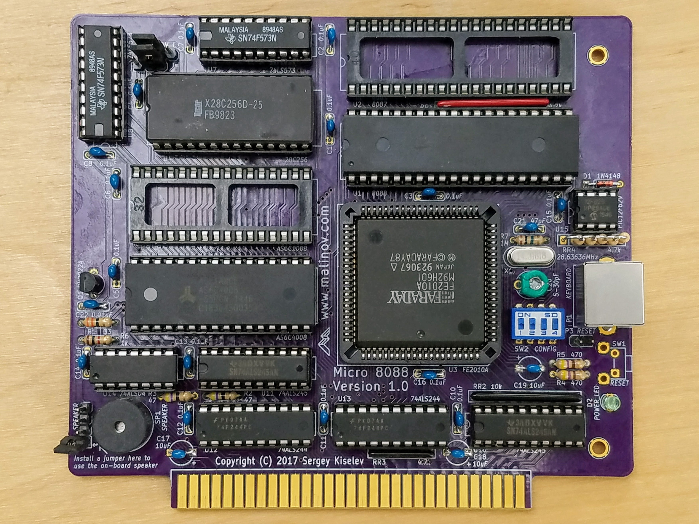

# Micro 8088
IBM XT Compatible Processor Board based on Faraday FE2010 chipset

## Introduction
This project is an attempt to create a simple to build IBM PC/XT compatible processor board.
The project uses a fairly common Faraday FE2010/FE2010A chipset, that implements most of IBM PC/XT LSIs (Intel 8xxx ICs) and glue logic.

## Specifications
* Processor: Intel 8088 or compatible, NEC V20
  * Supports IBM PC/XT standard 4.77 MHz CPU frequency, and (when using FE2010A chipset) 7.16 MHz and 9.54 MHz CPU frequencies
* Coprocessor: Intel 8087
* Faraday FE2010/FE2010A chipset, implementing the following components:
  * One 8237 direct memory access controller (DMAC)
  * One 8259 programmable interrupt controller (PIC)
  * One 8254 programmable interval timer (PIT)
  * One 8255 programmable peripheral interface (PPI)
  * Clock generation, and glue logic
* RAM: 512 KiB or 640 KiB base memory; Implemented using SRAM
* ROM: 32 KiB (28C256) EEPROM. Possible to replace with 16 KiB (27C128) or 32 KiB (27C256) EPROMs
* 8-bit ISA interface
* PS/2 compatible keyboard connector; built in XT2AT converter

## Hardware Documentation

### Schematic and PCB Layout

[Schematic - Version 1.0](KiCad/8088-FE2010A-SBC-Schematic-1.0.pdf)

[PCB Layout - Version 1.0](KiCad/8088-FE2010A-SBC-Board-1.0.pdf)

### Faraday FE2010/FE2010A specifics
This section documents features and quirks that are specific to Micro 8088, and to
Faraday FE2010 and FE2010A chipsets, and not present in standard IBM PC/XT.

#### CPU Clock Frequency / Turbo Mode Switching
This appears to be implemented only in Faraday FE2010A chipset (not in FE2010).
* XSEL signal (pin 18) of FE2010A (U3) used to select between 14.31818 MHz and 28.63636 MHz crystal frequency.
This signal should be pulled up for 14.31818 MHz and grounded for 28.63636 MHz. On Micro 8088 this signal is connected to SW1.4:
SW1.4 should be OFF for 14.31818 MHz and ON for 28.63636 MHz.
* Port 63h is used to select chipset configruation, including the CPU frequency:

Port 63h bit | Function
------------ | --------
0            | disable parity
1            | 8087 present (enable 8087 NMI)
2            | 256K RAM (1 bank)
3            | lock register (bits 0-4)
4            | 512K RAM size (2 banks)
5            | memory wait states (on ISA bus)
6            | 7.16 MHz CPU clock
7            | 9.54 MHz CPU clock
* According to the available documentation (Intel Wildcard 88 module, which appears to be using the same chipset):
  * Bit 5 controls the number of wait states when accessing memory on ISA bus:
    * Bit 5 == 0, 7.16 MHz CPU clock: 2 wait states
    * Bit 5 == 0, 9.54 MHz CPU clock: 4 wait states
    * Bit 5 == 1: 0 wait states, regardless of CPU clock
    * On-board memory (that is memory in range 0000h- 09FFFFh, first 640 KiB) always accessed with 0 wait states
    * ROM memory (0F0000h-0FFFFFh range?!) is always accessed with 0 wait states for 4.77 MHz, 2 wait states for 7.16 MHz clock, and 4 wait states for 9.54 MHz clock
* Some findings from my tests:
  * Setting bit 7 to 1 seems to override bit 6 value
  * When using 28.63636 MHz crystal (XSEL pin is grounded), setting bit 7 switches CPU clock frequency to 9.54 MHz,regardless of bit 6
  * When using 14.31818 MHz crystal (XSEL pin is pulled up), setting bit 7 switches CPU clock frequency to 4.77 MHz, regardless of bit 6
  * When using 14.31818 MHz crystal (XSEL pin is pulled up)
  * It appears that CPU clock duty cycle is 50% (excluding 4.77 MHz setting with 28.63636 MHz crystal, where duty cycle is 33%). This potentially can cause issues with some 8088 CPUs.

## Known Issues - Version 1.0
* System does not boot with NEC V20 CPU. Might be a BIOS related issue
* AS6C1008 (U6) does not have TTL compatible inputs causing instability with 640 KiB memory configruation
  * Workaround use CMOS transceiver U11, e.g. 74AHCT245

## TODO List - Version 1.0
- [x] Test with 14.31818 MHz and 28.63636 MHz crystals
- [x] Test 512 KiB and 640 KiB memory configuration
- [ ] Port Xi 8088 BIOS to Micro 8088
- [ ] Test with CMOS buffers, latches, and transceivers
